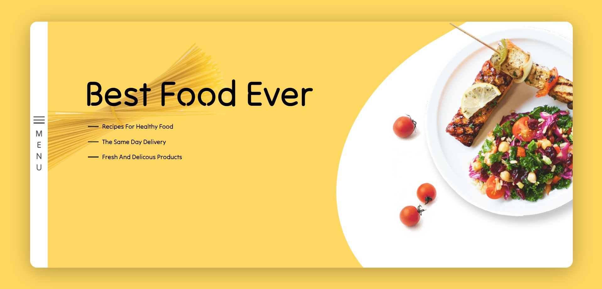
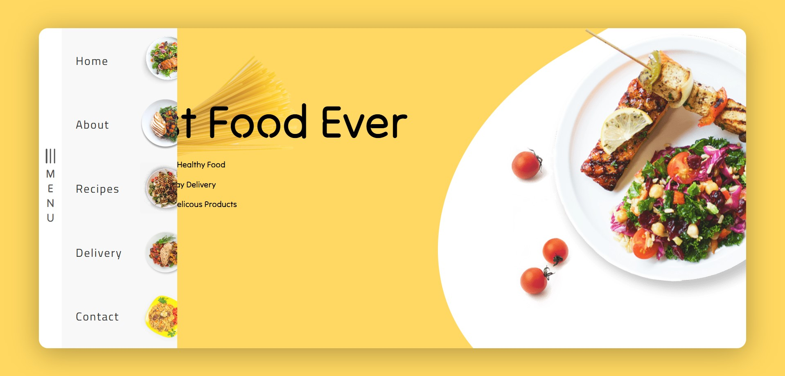

<!-- # Project - Food landing page design.

#### A website header with a hamburger menu.The website is going to be about something like food or recipes.
#### if i click it, then the navigation items will display nicely with some effects.

## Screenshot

****
 -->

# Project: Food Landing Page Design

This project features a modern landing page design focused on food and recipes. The page includes an intuitive and interactive website header with a hamburger menu. When the user clicks on the hamburger icon, the navigation items appear with smooth animations, enhancing the user experience.

## Features

- **Responsive Layout**: The design adjusts seamlessly across different screen sizes.
- **Interactive Hamburger Menu**: Clicking the hamburger icon reveals the navigation menu with stylish transition effects.
- **Food/Recipe Focus**: The website is centered around food, offering a delightful visual experience for culinary enthusiasts.

## Screenshots

### Landing Page View

### Hamburger Menu Animation

